  

 

# NAMAN GUPTA
`Software Engineer / Full-Stack / Distributed Systems`

---

### RADIAL TELEMETRY

  

---

### STATS

  
  

  

---

### STACK

`Java` · `C/C++` · `Python` · `TypeScript` · `JavaScript` · `React` · `Next.js` · `Node.js` · `Express` · `TailwindCSS` · `Docker` · `Linux` · `Git` · `Figma`

---

### LINKS

[LinkedIn](https://www.linkedin.com/in/namangupta30/) · [LeetCode](https://leetcode.com/u/namaninnovates/) · [Instagram](https://www.instagram.com/heynamann/)
