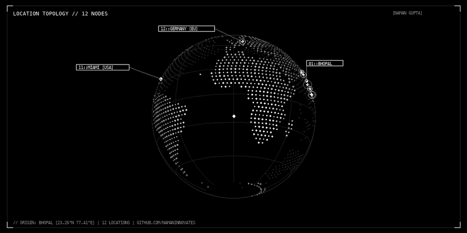

<div align="center">
  
</div>

<br>

# NAMAN GUPTA
`Software Engineer / Full-Stack / Distributed Systems`

---

### LOCATIONS WORKED

```
[01] BHOPAL       23.2599° N,  77.4126° E  (ORIGIN)
[02] NEW DELHI    28.6139° N,  77.2090° E
[03] MUMBAI       19.0760° N,  72.8777° E
[04] BANGALORE    12.9716° N,  77.5946° E
[05] HYDERABAD    17.3850° N,  78.4867° E
[06] CHENNAI      13.0827° N,  80.2707° E
[07] KOLKATA      22.5726° N,  88.3639° E
[08] CHANDIGARH   30.7333° N,  76.7794° E
[09] VELLORE      12.9165° N,  79.1325° E
[10] TRIPURA      23.8315° N,  91.2868° E
[11] MIAMI [USA]  25.7617° N, -80.1918° W
[12] GERMANY [EU] 51.1657° N,  10.4515° E
```

---

### STATS

<p align="center">
  
  
</p>

<p align="center">
  
</p>

---

### STACK

<p align="center">
  
</p>

---

### LINKS

[LinkedIn](https://www.linkedin.com/in/namangupta30/) · [LeetCode](https://leetcode.com/u/namaninnovates/) · [Instagram](https://www.instagram.com/heynamann/)
