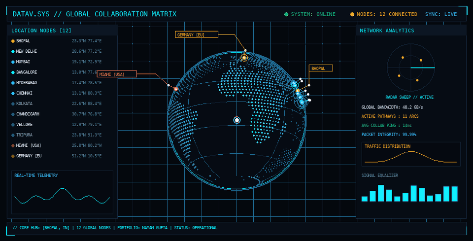

  

 

  <h1>⚡ NAMAN GUPTA ⚡</h1>
  

    
  

---

## 🌐 Global Impact & Collaboration Network

> 🛰️ *Interactive telemetry mapped across active engineering hubs and client collaboration nodes worldwide.*

| Region | Active Nodes & Collaborations | Focus Areas |
| :--- | :--- | :--- |
| 🇮🇳 **India Core** | **Bhopal** *(Central Hub)*, **New Delhi**, **Mumbai**, **Bangalore**, **Hyderabad**, **Chennai**, **Kolkata**, **Chandigarh**, **Vellore**, **Tripura** | SaaS Systems, CRM Platforms, High-Throughput Web Applications |
| 🇺🇸 **North America** | **Miami, Florida** | SaaS Product Architecture & Cross-Border Delivery |
| 🇩🇪 **Europe** | **Germany** | Enterprise Software Solutions & Distributed Engineering |

---

## ⚡ Mission Directives & About Me

- 🚀 **Building**: Scalable SaaS platforms, modular CRM frameworks, and AI-driven automation workflows
- 🌍 **Distributed Engineering**: Proven track record collaborating across **12 global nodes** across North America, Europe, and India
- 🎨 **Creative & UX**: Blending robust software engineering with modern UI/UX design and video production
- 💡 **Problem Solving**: Active competitive programmer solving complex algorithmic challenges on [LeetCode](https://leetcode.com/u/namaninnovates/)

---

## 📊 Live GitHub Telemetry

  
  

  

---

## 🛠️ Tech Stack & Ecosystem

  <b>Core Languages</b> 
  

  <b>Frameworks & Full-Stack</b> 
  

  <b>Tools, Design & Infrastructure</b> 
  

---

## 📫 Communication Channels & Connect

  
  &nbsp;
  
  &nbsp;
  

 

  <i>✨ "Dream. Believe. Achieve." ✨</i>

